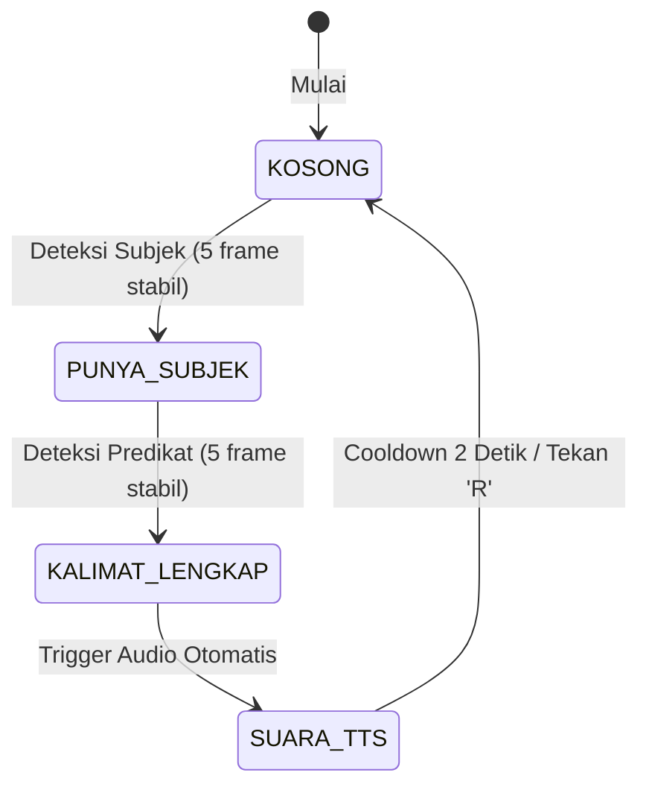
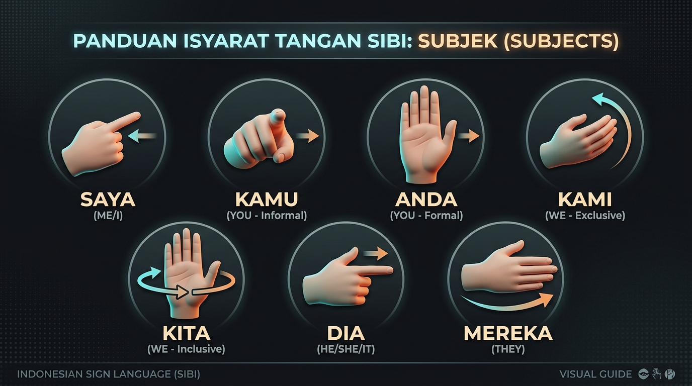
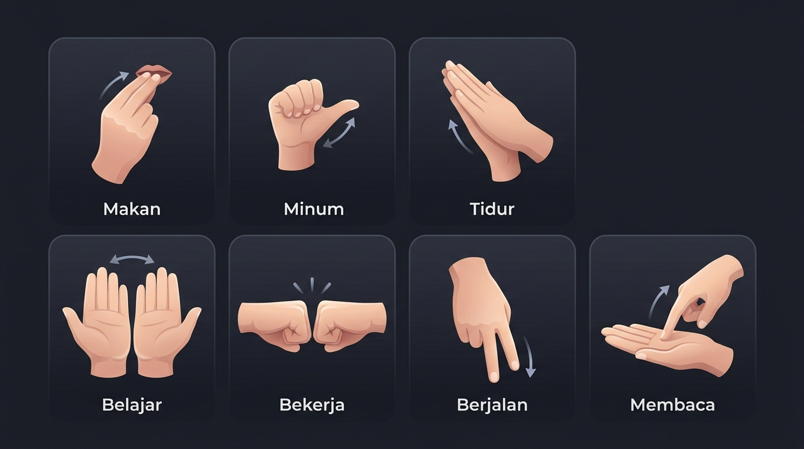

# PANDUAN BENTUK GESTUR TANGAN & PENGUJIAN ML (ISYARATKU-EDGE)

Dokumen ini adalah panduan lengkap cara membentuk gestur tangan untuk **14 kata SIBI/BISINDO**, aturan penyusunan kalimat, serta cara melakukan pengujian interaktif secara visual.

---

## 1. Aturan Pembentukan Kalimat (State Machine)

Sistem IsyaratKu-Edge menyusun kalimat berdasarkan struktur bahasa isyarat standar:



1. **Langkah 1 (Subjek):** Bentuk salah satu gestur Subjek di depan kamera, tahan selama $\pm 0.5$ detik (5 frame berturut-turut).
2. **Langkah 2 (Predikat):** Ganti gestur tangan menjadi salah satu gestur Predikat, tahan selama $\pm 0.5$ detik.
3. **Langkah 3 (Selesai):** Kalimat otomatis dirangkai (contoh: *"Saya belajar."*), audio TTS membacakan kalimat lewat speaker, dan sistem siap untuk kalimat berikutnya.
4. **Reset:** Tekan tombol **`R`** pada keyboard kapan saja untuk membatalkan kalimat dan mengulang dari awal.

---

## 2. Panduan Bentuk Tangan: 7 Kata Subjek



| Kata | Bentuk Jari & Tangan | Posisi & Orientasi | Ilustrasi Mental |
| :--- | :--- | :--- | :--- |
| **`saya`** | Jari **telunjuk lurus**, 4 jari lainnya (ibu jari, tengah, manis, kelingking) mengepal rileks. | Ujung telunjuk diarahkan menyentuh atau mendekati bagian **tengah dada sendiri**. | Menunjuk diri sendiri |
| **`kamu`** | Jari **telunjuk lurus horizontal** ke depan, 4 jari lainnya mengepal. | Punggung tangan menghadap ke atas/luar, ujung jari mengarah langsung ke **kamera/lawan bicara**. | Menunjuk orang di depan |
| **`anda`** | **Kelima jari terbuka rapat dan lurus** (telapak tangan rata). | Telapak tangan menghadap ke atas/miring ke depan, diarahkan dengan sopan ke arah kamera. | Sikap mempersilakan secara formal |
| **`kami`** | Tangan terbuka sedikit melengkung (seperti huruf 'C' rileks). | Gerakkan tangan dari samping dada mendekat melengkung ke arah dada sendiri. | Mengelompokkan diri sendiri tanpa lawan bicara |
| **`kita`** | Jari telunjuk atau telapak tangan terbuka rileks. | Buat **gerakan melingkar horizontal kecil** di depan dada yang merangkum Anda dan kamera. | Gerakan merangkul semua orang |
| **`dia`** | Jari **telunjuk lurus**, jari lainnya mengepal. | Arahkan telunjuk ke arah **samping kanan atau kiri** (ke arah orang ketiga). | Menunjuk seseorang di samping |
| **`mereka`** | Jari telunjuk atau telapak tangan terbuka ke samping. | Lakukan **gerakan sapuan (sweep)** ke arah samping secara melebar. | Menunjuk banyak orang di samping |

---

## 3. Panduan Bentuk Tangan: 7 Kata Predikat



| Kata | Bentuk Jari & Tangan | Posisi & Orientasi | Ilustrasi Mental |
| :--- | :--- | :--- | :--- |
| **`makan`** | Kelima ujung jari (ibu jari, telunjuk, tengah, manis, kelingking) **menguncup bersamaan**. | Ujung jari yang menguncup diarahkan mendekati dan menyentuh bagian **depan mulut** secara berulang. | Menyuap makanan ke mulut |
| **`minum`** | Jari tangan menekuk membentuk silinder/cangkir, **ibu jari tegak mengarah ke bibir**. | Tangan digerakkan sedikit mendongak ke arah mulut seolah memegang gelas. | Meminum dari cangkir |
| **`tidur`** | **Telapak tangan terbuka rata dan rapat**. | Tempelkan telapak tangan di samping pipi/telinga dengan kepala sedikit dimiringkan ke tangan. | Menjadikan tangan sebagai bantal |
| **`belajar`** | **Kedua telapak tangan mendatar** menghadap ke atas (atau satu tangan terbuka datar di depan dada). | Posisi tangan seperti memegang dan membaca buku yang terbuka lebar. | Membuka buku pelajaran |
| **`bekerja`** | Tangan **mengepal erat**. | Lakukan gerakan mengetuk ke bawah berulang kali seperti memegang alat kerja/palu. | Aktivitas memalu/mengetuk |
| **`berjalan`** | Jari **telunjuk dan tengah diluruskan ke bawah**, jari lainnya ditekuk (menyerupai 2 kaki). | Gerakkan kedua jari tersebut maju-mundur bergantian seolah-olah sedang melangkah. | Dua jari sebagai kaki berjalan |
| **`membaca`** | Satu tangan terbuka datar mendatar (buku), tangan lainnya dengan jari telunjuk menelusuri. | Jari telunjuk bergerak dari kiri ke kanan di atas telapak tangan datar tersebut. | Menelusuri baris kalimat di buku |

---

## 4. Cara Melakukan Pengujian Interaktif

Jalankan skrip pengujian debug dari terminal (pastikan venv aktif):

```powershell
python pc_workspace/testing/test_pipeline_debug.py
```

### Indikator Pada Layar (HUD):
- **Boks Kiri Atas (Performance HUD):**
  - `FPS`: Menampilkan kecepatan frame (target $\ge 25$ FPS di PC).
  - `Total Latency`: Waktu proses total per frame dalam milidetik (ms).
  - `Breakdown`: Waktu proses YOLO, MediaPipe, dan 1D-CNN+LSTM.
  - `Buffer`: Menunjukkan isi buffer sekuens temporal (`X/12` frame).
- **Skeleton Landmark:**
  - Garis hijau terang menghubungkan sendi-sendi jari.
  - Titik kuning emas menandai 21 koordinat sendi tangan Anda.
- **Boks Bawah (Kalimat & Keyakinan):**
  - `Conf`: Bar persentase tingkat keyakinan model terhadap gestur.
  - `Kalimat`: Menampilkan kata Subjek yang sudah terkunci dan menunggu kata Predikat.
  - `Gestur`: Kelas gestur aktif yang sedang dibaca oleh model.

### Tombol Kontrol:
- **`H`**: Menampilkan / menyembunyikan contekan panduan gestur langsung di layar kamera.
- **`R`**: Mereset kalimat dan sequence buffer menjadi kosong kembali.
- **`Q`**: Menutup kamera dan keluar dari program.
