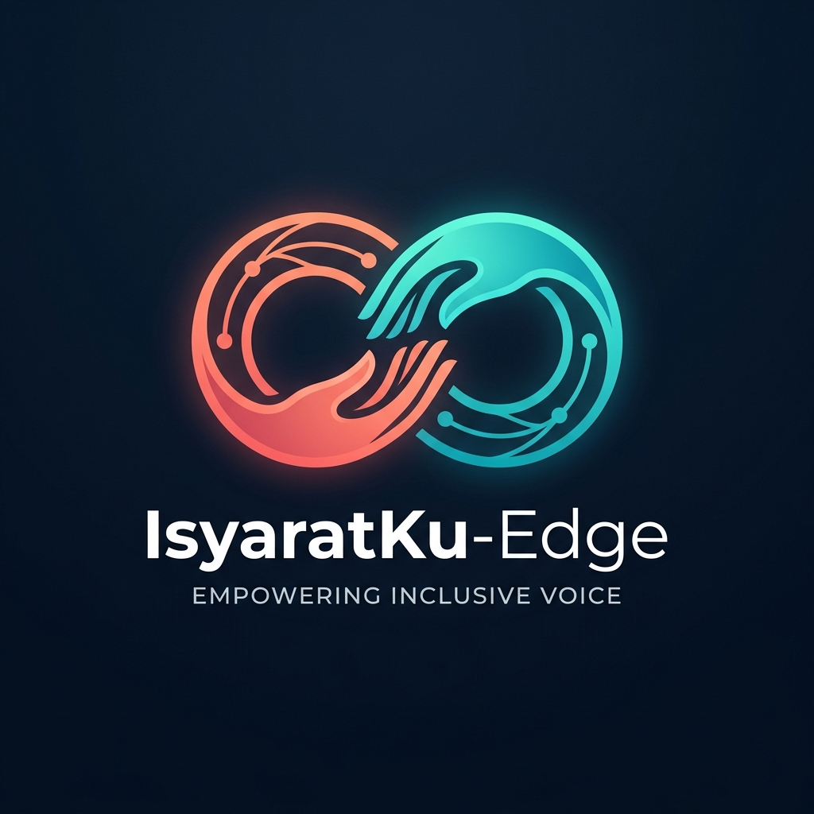

<p align="center">
  
</p>

<h1 align="center">IsyaratKu-Edge</h1>
<p align="center">
  <em>Empowering Inclusive Voice — Real-Time Edge AI Hand Gesture Translation System</em>
</p>

<p align="center">
  <a href="LICENSE"></a>
  
  
  
  
</p>

<p align="center">
  Sistem Pengenalan dan Penerjemahan Bahasa Isyarat secara Real-Time berbasis Machine Learning untuk Lingkungan IoT (<strong>ESP32-CAM + Raspberry Pi 5 / PC</strong>).
</p>

---

### 🕊️ Filosofi & Makna Logo

Logo **IsyaratKu-Edge** merefleksikan nilai-nilai kesetaraan sosial dan komunikasi inklusif:

1. **Dua Tangan yang Bertemu dalam Lingkaran Tanpa Ujung (Infinity Loop):**
   Melambangkan komunikasi dua arah yang setara antara teman Tuli dan masyarakat dengar. Tidak ada pihak yang "lebih tinggi" atau "dibanding-bandingkan" — semua manusia setara dalam hak berekspresi dan didengarkan.
2. **Harmoni Warna Gradien Hangat (Coral) & Sejuk (Cyan-Teal):**
   Melambangkan kehangatan empati kemanusiaan yang berpadu dengan ketenangan inovasi teknologi. Perbedaan bukanlah jurang pemisah, melainkan keindahan yang saling melengkapi dalam satu ekosistem sosial.
3. **Simpul & Jalur Sirkuit Digital (Edge AI Nodes):**
   Menggambarkan teknologi komputasi tepi (*Edge Computing*) yang bekerja langsung di dekat pengguna, senyap namun bertenaga, hadir sebagai jembatan yang menghubungkan hati dan pikiran tanpa batas keterbatasan fisik.

---

## 📁 Struktur Folder Proyek

```text
IsyaratKu-edge/
├── configs/
│   ├── labels.json               # 14 kelas gestur (7 Subjek + 7 Predikat)
│   └── settings.py               # Konfigurasi resolusi, buffer, dan path model
│
├── core/                         # LOGIKA ML INTI (Shared antara PC & SBC)
│   ├── __init__.py
│   ├── yolo_detector.py          # Deteksi tangan (YOLOv8n)
│   ├── mediapipe_extractor.py    # Ekstraksi 21 koordinat landmark 3D
│   ├── landmark_normalizer.py    # Normalisasi translasi & skala (wrist-centered)
│   ├── spatial_cnn.py            # 1D-CNN spatial encoder (64-d vector)
│   ├── temporal_lstm.py          # LSTM temporal sequence classifier (12 frames)
│   ├── sentence_builder.py       # State Machine (Subjek + Predikat)
│   └── tts_engine.py             # Non-blocking Text-to-Speech engine
│
├── pc_workspace/                 # LINGKUNGAN PC / LAPTOP (Training & Debugging)
│   ├── training/                 # Skrip training mandiri (ekstraksi landmark, 1D-CNN, LSTM)
│   │   └── 01_extract_landmarks.py
│   ├── testing/                  # MODUL PENGUJIAN DENGAN PERFORMANCE HUD
│   │   ├── test_stream_fps.py      # Uji FPS & latency kamera
│   │   ├── test_yolo_latency.py    # Uji waktu inferensi YOLO (ms)
│   │   ├── test_mediapipe_fps.py   # Uji tracking 21 landmark MediaPipe
│   │   └── test_pipeline_debug.py  # UJI FULL PIPELINE DENGAN VISUAL HUD LENGKAP
│   └── main_pc.py                # Main runner PC (toggle Clean vs Debug mode)
│
├── sbc_workspace/                # LINGKUNGAN SBC (Raspberry Pi 5 - Clean Edge)
│   ├── main_sbc.py               # RUNNER PRODUKSI BERSIH (Zero Rendering Overhead)
│   └── service_health.py         # Systemd health & monitoring reporter (CPU/RAM/Temp)
│
├── data/
│   ├── dataset_raw/              # Video/gambar mentah per kelas (.gitignore)
│   ├── landmarks_cache/          # Dataset koordinat .npy (.gitignore)
│   └── models/                   # Model tersimpan (.onnx, .tflite)
│
├── docs/                         # DOKUMENTASI VISUAL & PANDUAN
│   ├── logo.jpg                  # Logo resmi IsyaratKu-Edge (Inklusivitas & Kesetaraan)
│   ├── panduan_subjek.jpg        # Poster panduan gestur 7 Subjek
│   └── panduan_predikat.jpg      # Poster panduan gestur 7 Predikat
│
├── Feedback/                     # Catatan internal user (Diabaikan oleh Git via .gitignore)
├── PANDUAN_GESTUR.md             # Panduan lengkap gestur tangan & cara pengujian
├── requirements-pc.txt           # Dependensi lengkap PC
├── requirements-sbc.txt          # Dependensi ringan SBC
├── .gitignore                    # Konfigurasi pengabaian Git
└── README.md
```

---

## 🖥️ Perbedaan Preview: Testing (PC) vs Implementasi (SBC)

| Fitur | Mode Testing (`pc_workspace/testing/`) | Mode Produksi (`sbc_workspace/main_sbc.py`) |
|---|---|---|
| **Tampilan Visual** | **Rich Performance HUD**: Bounding box YOLO, 21 titik skeleton MediaPipe, garis koneksi sendi berwarna. | **Clean Output**: Hanya menampilkan frame video bersih dengan bar subtitle kalimat terjemahan. |
| **Metrik Performa** | **Tampil Lengkap**: FPS kamera, FPS inferensi, breakdown latensi (ms), confidence score %, status buffer. | **Tidak Ditampilkan**: Menghilangkan seluruh teks performa untuk menghemat 100% beban rendering GPU/CPU di SBC. |
| **Tujuan** | Analisis performa, pencatatan data skripsi/TA, dan debugging model. | Operasional harian di lapangan untuk pengguna masyarakat. |

---

## 🚀 Cara Menjalankan

### 1. Di PC / Laptop (Mode Pengujian & Debug)

```bash
# Install dependensi PC
pip install -r requirements-pc.txt

# Menjalankan Uji Full Pipeline dengan Heads-Up Display (HUD) Lengkap
python pc_workspace/testing/test_pipeline_debug.py

# Menjalankan Uji FPS Kamera
python pc_workspace/testing/test_stream_fps.py

# Menjalankan Uji Latensi YOLO
python pc_workspace/testing/test_yolo_latency.py

# Menjalankan Uji Ekstraksi MediaPipe
python pc_workspace/testing/test_mediapipe_fps.py

# Menjalankan Runner Utama PC (Tekan 'd' untuk toggle debug HUD, 'r' untuk reset kalimat)
python pc_workspace/main_pc.py --debug
```

### 2. Di SBC (Raspberry Pi 5 - Mode Produksi Bersih)

```bash
# Install dependensi ringan SBC
pip install -r requirements-sbc.txt

# Menjalankan runner produksi (Clean View / Subtitle Bar saja)
python sbc_workspace/main_sbc.py

# Menjalankan mode headless (untuk background service systemd)
python sbc_workspace/main_sbc.py --headless

# Cek kondisi kesehatan hardware SBC (CPU, RAM, Suhu)
python sbc_workspace/service_health.py
```

---

## 🖐️ Panduan Visual Bentuk Gestur Tangan (SIBI/BISINDO)

Untuk mempermudah pengguna mempraktikkan gestur tangan tanpa kebingungan, berikut adalah panduan visual bentuk tangan untuk **14 kata**:

### 1. Kategori Subjek (7 Kata)
Bentuk tangan untuk kata: **Saya, Kamu, Anda, Kami, Kita, Dia, Mereka**


| Kata | Bentuk Tangan & Arah | Panduan Gerak Singkat |
| :--- | :--- | :--- |
| **`Saya`** | Jari telunjuk lurus, 4 jari mengepal | Ujung telunjuk menunjuk ke tengah dada sendiri |
| **`Kamu`** | Jari telunjuk lurus horizontal ke depan | Menunjuk lurus ke arah lawan bicara / kamera |
| **`Anda`** | Kelima jari terbuka rapat dan datar | Telapak tangan terbuka santun ke arah depan |
| **`Kami`** | Tangan melengkung seperti huruf 'C' | Digerakkan melengkung mendekat ke dada sendiri |
| **`Kita`** | Tangan terbuka / telunjuk rileks | Gerakan melingkar mendatar di depan dada |
| **`Dia`** | Jari telunjuk lurus | Menunjuk ke arah samping kanan / kiri |
| **`Mereka`** | Jari telunjuk / telapak tangan terbuka | Gerakan sapuan (sweep) melebar ke arah samping |

---

### 2. Kategori Predikat (7 Kata)
Bentuk tangan untuk kata: **Makan, Minum, Tidur, Belajar, Bekerja, Berjalan, Membaca**


| Kata | Bentuk Tangan & Arah | Panduan Gerak Singkat |
| :--- | :--- | :--- |
| **`Makan`** | Kelima ujung jari menguncup bersamaan | Ujung jari mendekati bibir / mulut berulang kali |
| **`Minum`** | Jari melingkar cangkir, ibu jari tegak | Mengarahkan ibu jari ke bibir seperti minum cangkir |
| **`Tidur`** | Telapak tangan terbuka rapat datar | Telapak tangan ditempel di pipi seperti bantal |
| **`Belajar`** | Kedua telapak tangan mendatar ke atas | Membuka kedua tangan di dada seolah membaca buku |
| **`Bekerja`** | Tangan mengepal erat | Gerakan mengetuk ke bawah berulang (seperti palu) |
| **`Berjalan`** | Jari telunjuk & jari tengah mengarah ke bawah | Digerakkan melangkah maju-mundur bergantian |
| **`Membaca`** | Satu tangan datar (buku), satu telunjuk | Jari telunjuk menelusuri baris di atas telapak datar |

---

## 🔄 Aturan Pembentukan Kalimat (State Machine)

1. **Kunci Subjek:** Posisikan tangan membentuk salah satu kata **Subjek**, tahan selama $\pm 0.5$ detik (5 frame berturut-turut). Layar bawah akan mengunci kata subjek tersebut.
2. **Kunci Predikat:** Ganti bentuk tangan ke salah satu kata **Predikat**, tahan selama $\pm 0.5$ detik.
3. **Kalimat Terbentuk:** Kalimat otomatis terangkai (misal: *"Saya makan."*), dan audio TTS langsung menyuarakannya lewat speaker.
4. **Kontrol Cepat di Layar Testing (`test_pipeline_debug.py`):**
   - **`H`**: Menampilkan contekan panduan gestur langsung di layar kamera.
   - **`R`**: Reset kalimat dan buffer memori sequence.
   - **`Q`**: Keluar dari pengujian.

---

## 🎓 Konteks Akademik & Penelitian

Proyek ini dikembangkan sebagai bagian dari Tugas Akhir (TA) pada Program Studi Teknik Komputer, Jurusan Teknologi Informasi, Politeknik Negeri Jember:

- **Judul Penelitian:** *Implementasi Machine Learning untuk Deteksi Hand Gesture pada Sistem IoT Berbasis ESP32-CAM*
- **Peneliti / Pengembang:** **Aiyub Heriyanto** (NIM: `E32240140`)
- **Dosen Pembimbing:** **I Gede Wiryawan, S.Kom., M.Kom.** (NIP: `19880117 20190 1 008`)
- **Institusi:** Politeknik Negeri Jember (POLIJE), 2026
- **Lokasi Mitra & Pengujian Lapangan:** Kedai Susu Tuli Jember (Jl. Manggis No. 95, Krajan, Jemberlor, Kec. Patrang, Kabupaten Jember)

---

## 📚 Sumber Referensi & Kajian Literatur (References)

Pengembangan sistem dan model kecerdasan buatan pada repositori ini berlandaskan pada studi literatur dan kajian ilmiah berikut:

1. **Wiryawan, I. G., Rizaldi, T., Puspitasari, P. S. D., & Kurniasari, A. A. (2025).** *Hand Gesture Detection Implemented based on Long Short-Term Memory (LSTM) Method*. **Jurnal Sistem Cerdas**, 8(3), 343–351. [https://doi.org/10.37396/jsc.v8i3.526](https://doi.org/10.37396/jsc.v8i3.526)
2. **Kurniasari, A. A., Wiryawan, I. G., Shinta, P., & Puspitasari, D. (2025).** *Implementasi Deteksi Gerakan Tangan untuk Sistem Interaktif Kios menggunakan Metode Long Short-Term Memory (LSTM)*. **Komputika: Jurnal Sistem Komputer**, 14(1), 31–39. [https://doi.org/10.34010/y895rc89](https://doi.org/10.34010/y895rc89)
3. **Saputro, M. F. A. C., Hadiyoso, S., Irawati, I. D., & Rizal, A. (2026).** *Real-Time Hand Gesture-Based Virtual Mouse System Using ESP32-CAM and OpenCV*. **Jurnal RESTI (Rekayasa Sistem dan Teknologi Informasi)**, 10(1), 53–61. [https://doi.org/10.29207/resti.v10i1.6609](https://doi.org/10.29207/resti.v10i1.6609)
4. **Imam, A. M., Wardana, A. B., Armyanto, J., & Rahman, M. R. D. S. (2025).** *Klasifikasi Gestur BISINDO Berbasis Landmark Tangan-Lengan Menggunakan Mediapipe Holistic dan Random Forest*. **JSITIK: Jurnal Sistem Informasi Dan Teknologi Informasi Komputer**, 4(1), 31–39. [https://doi.org/10.53624/jsitik.v4i1.718](https://doi.org/10.53624/jsitik.v4i1.718)
5. **Lugaresi, C., Tang, J., Nash, H., McClanahan, C., Uboweja, E., Hays, M., Zhang, F., Chang, C. L., Yong, M. G., Lee, J., Chang, W. T., Hua, W., Georg, M., & Grundmann, M. (2022).** *MediaPipe: A Framework for Building Perception Pipelines*. **arXiv preprint arXiv:1906.08172**.
6. **Terven, J., & Cordova-Esparza, D. (2023).** *A Comprehensive Review of YOLO: From YOLOv1 and Beyond*. **ACM Computing Surveys**.
7. **Dewangga, S., Subianto, M., & Swastika, W. (2024).** *Implementation of Hand Gesture Recognition as Smart Home Devices Controller*. **Journal of Intelligent System and Computation**, 6(2), 63–68. [https://doi.org/10.52985/insyst.v6i2.372](https://doi.org/10.52985/insyst.v6i2.372)
8. **Sani, A., & Rahmadinni, S. (2022).** *Deteksi Gestur Tangan Berbasis Pengolahan Citra*. **Jurnal Rekayasa Elektrika**, 18(2), 115–124. [https://doi.org/10.17529/jre.v18i2.25147](https://doi.org/10.17529/jre.v18i2.25147)
9. **Yasen, M., & Jusoh, S. (2019).** *A Systematic Review on Hand Gesture Recognition Techniques, Challenges and Applications*. **PeerJ Computer Science**, 5, e218. [https://doi.org/10.7717/peerj-cs.218](https://doi.org/10.7717/peerj-cs.218)
10. **Azis, M. A. (2026).** *Rancang Bangun Pendeteksi Nominal Mata Uang Rupiah Berbasis IoT untuk Penyandang Tunanetra Menggunakan Modul ESP32-CAM*. Laporan Tugas Akhir, Program Studi Teknik Komputer, Politeknik Negeri Jember.

---

## 📜 Lisensi Open-Source (Open-Source License)

Proyek **IsyaratKu-Edge** adalah perangkat lunak sumber terbuka (*open-source software*) yang dirilis di bawah naungan **[MIT License](LICENSE)**.

```text
Hak Cipta (c) 2026 Aiyub Heriyanto & Kontributor Komunitas IsyaratKu-Edge.
Dilisensikan di bawah Lisensi MIT - Siapapun bebas menggunakan, mempelajari, memodifikasi, 
dan mendistribusikan perangkat lunak ini untuk keperluan akademis, non-komersial, maupun komersial.
```

Kode sumber, model komputasi, dan dokumentasi ini didedikasikan untuk kemajuan riset teknologi asistif bagi penyandang disabilitas di Indonesia dan dunia.

---

## 💡 Cara Mengutip (Citation)

Jika Anda menggunakan repositori, arsitektur pipeline, atau dataset IsyaratKu-Edge ini dalam penelitian akademis, silakan kutip sebagai berikut:

```bibtex
@misc{heriyanto2026isyaratku,
  author    = {Aiyub Heriyanto and I Gede Wiryawan},
  title     = {IsyaratKu-Edge: Real-Time Hand Gesture Recognition and Translation System on Embedded Edge IoT},
  year      = {2026},
  publisher = {GitHub},
  howpublished = {\url{https://github.com/Aiyub150/IsyaratKu-Edge}},
  note      = {Tugas Akhir Teknik Komputer, Politeknik Negeri Jember}
}
```
